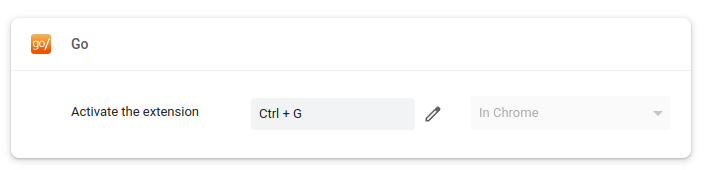
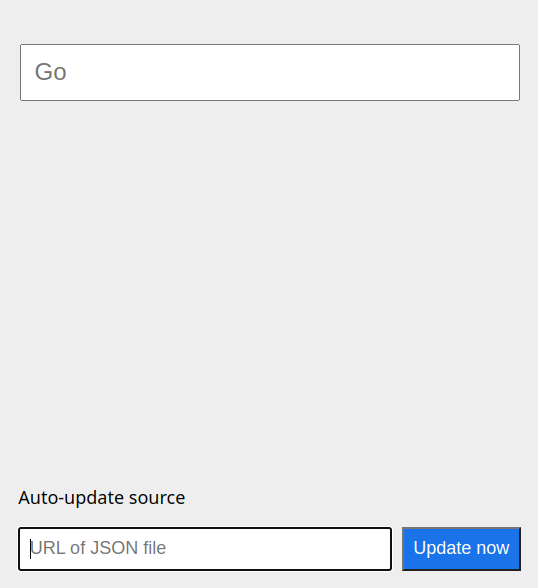

# Installation

## Get the extension

This is only available for Chrome right now (sorry). The extension is still
being approved in the Chrome webstore, so you need to install it manually for
now.

Start by **downloading the extension** from its
[GitHub Page](https://github.com/lmanul/go-links). Click on the green
button and select "Download ZIP":

And unzip the archive you've downloaded. Back in Chrome, head to **Extensions**:

If it's off, flip the "**developer**" toggle (top right). Then click on "**Load
unpacked**" (top left).

Select the folder you have just unzipped.

## Set a keyboard shortcut

On this same Extensions page, click on the top left "hamburger" menu:

and pick "Keyboard Shortcuts". Find the "Go" extension and click on the "edit"
button:

We recommend `Ctrl-G` and will be assuming that below.

# Configuration

The extension gets its shortcut definitions from an JSON file that it updates
regularly. Hit `Ctrl-G` to open the extension, paste the URL to that JSON
file, and click on "Update now".

# Usage

Hit `Ctrl-G` and type a few letters. Hit `Enter` to go to the first result,
or click on one of the results in the list.

